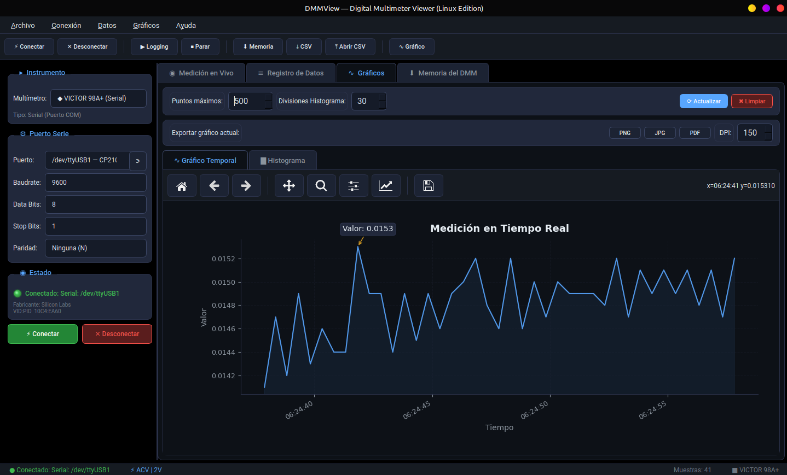

# DMMView v3.3.1

Aplicación de visualización, registro de datos (logging) y análisis para multímetros digitales (DMM). Diseñada nativamente con soporte multiplataforma para **Linux** y **Windows 10/11**.



## Características Principales

* **Visualización en Vivo:** Pantalla LCD digital con barra analógica animada, estadísticas en tiempo real (mín, máx, promedio, Δ) y soporte de visualización secundaria/terciaria.
* **Registro de Datos (Data Logging):** Captura continua de lecturas con opción de iniciar, pausar y exportar los datos registrados a formato **CSV**.
* **Análisis de Gráficos:**
  * Gráfico de línea temporal interactivo con función de **Zoom** (arrastrar con el mouse) y **Hover** para visualizar el valor exacto de cualquier punto.
  * Histograma dinámico de frecuencias para ver la distribución de valores.
  * Capacidad de importar archivos CSV generados para análisis offline.
* **Descarga de Memoria Interna:** Permite descargar registros manuales o temporizados guardados en la memoria interna de instrumentos compatibles (como Fluke 289 y Victor 98A+).
* **Multiplataforma:** Optimizaciones de interfaz nativas y fuentes adecuadas para Linux Mint / Ubuntu y Windows 10/11.

---

## Instrumentos Soportados

| Multímetro | Tipo de Conexión | Protocolo / Chip |
| :--- | :--- | :--- |
| **VICTOR 98A+** | Serie (COM / ttyUSB) | Protocolo binario DMMVIEW_G |
| **Fluke 287 / 289** | Serie Óptico (IR USB) | Comandos ASCII |
| **UNI-T UT-61E+** | USB HID Directo | Binario sobre puente CP2110 |
| **UNI-T UT-181A** | USB HID Directo | Puente UART a HID CP2110 |
| **Brymen BM250s** | Serie Óptico (BRUA-20X) | Trama de segmentos de pantalla LCD (15 bytes) |
| **EEVBlog 121GW** | Bluetooth Low Energy | Paquetes binarios BLE (19 bytes) |
| **OWON XDM1041 / XDM1241** | Serie Virtual USB | Comandos SCPI estándar |
| **OWON XDM3041 / XDM3051** | Serie Virtual USB | Comandos SCPI estándar |

---

## Requisitos de Instalación

Asegúrate de contar con Python 3 instalado. Luego instale las dependencias necesarias:

```bash
pip install -r requirements.txt
```

*Nota:* Para la conexión Bluetooth en Linux con el EEVBlog 121GW, se requiere la librería `bleak`. Para UNI-T en Windows/Linux, se requiere `hidapi`.

---

## Instrucciones de Ejecución

### En Linux (Mint, Ubuntu, Debian, etc.):
Ejecute desde su terminal:
```bash
python3 dmmview.py
```
*Tip:* Asegúrese de que su usuario pertenezca al grupo `dialout` para acceder a los dispositivos serie sin permisos de administrador:
```bash
sudo usermod -a -G dialout $USER
```

### En Windows (10/11):
Ejecute desde la consola CMD o PowerShell:
```cmd
python dmmwin.py
```

---

## Empaquetar para Windows (.EXE Portable)
Si desea generar un archivo ejecutable `.exe` independiente para llevarlo en un pendrive a máquinas Windows que no tengan Python instalado:
1. Abra esta carpeta en un equipo Windows.
2. Ejecute el script por lotes:
   ```cmd
   build_windows.bat
   ```
3. Su archivo portable se generará en la carpeta `dist/DMMView_3_3_1.exe`.

---

## Empaquetar para Linux (DEB & Flatpak)
Para generar paquetes instalables y portables en sistemas Linux, se incluyen los siguientes scripts:

### Construir Instalador Debian (.deb):
Ejecute el script en su terminal:
```bash
./build_deb.sh
```
El archivo resultante se guardará en `dist/DMMView_3.3.1.deb`. Para instalarlo:
```bash
sudo dpkg -i dist/DMMView_3.3.1.deb
```

### Construir Contenedor Portable Flatpak (.flatpak):
Asegúrese de contar con `flatpak-builder` instalado (`sudo apt install flatpak-builder`), y luego ejecute:
```bash
./build_flatpak.sh
```
El paquete se generará en `dist/DMMView_3.3.1.flatpak`. Para instalarlo:
```bash
flatpak install --user dist/DMMView_3.3.1.flatpak
```

---

## Documentación Técnica de Protocolos
Para desarrolladores interesados en ampliar o mantener el soporte de instrumentos, se incluye documentación detallada sobre los protocolos en el directorio **[doc/](doc/README.md)**.

