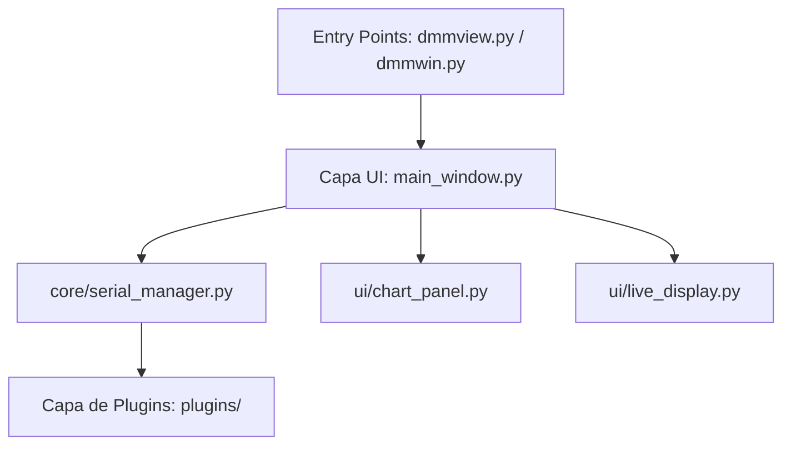

# Guía de Desarrollo - DMMView

Esta guía describe la arquitectura de **DMMView** y provee las directrices necesarias para que otros desarrolladores colaboren con el proyecto, mantengan el código o implementen soporte para nuevos multímetros.

---

## 1. Arquitectura del Proyecto

DMMView sigue un patrón arquitectónico desacoplado en tres capas principales:



### A. Capa de Inicialización (Puntos de Entrada)
* **`dmmview.py`**: Punto de entrada optimizado para **Linux**. Realiza la comprobación de permisos del grupo `dialout` antes de iniciar la app.
* **`dmmwin.py`**: Punto de entrada optimizado para **Windows**. Forza el escalado de DPI altos y define la tipografía nativa `Segoe UI`.

### B. Capa de Interfaz Gráfica (UI)
Diseñada usando **PyQt6** con un sistema de diseño premium, oscuro y moderno (`ui/styles.py`).
* **`ui/main_window.py`**: Controlador principal de la ventana y administrador de la lógica de negocio general.
* **`ui/live_display.py`**: Pantalla LCD dinámica con barras analógicas y visualización secundaria.
* **`ui/chart_panel.py`**: Integración de gráficos interactivos usando Matplotlib (soporta Zoom de caja y cursor interactivo con etiqueta flotante).
* **`ui/connection_panel.py`**: Panel izquierdo para la selección de multímetros y configuración de puertos serie.
* **`ui/memory_panel.py`**: Tabla interactiva y barra de progreso para la descarga de memorias internas.

### C. Capa de Comunicación (Core)
* **`core/serial_manager.py`**: Administra la conexión física (puertos serie usando `pyserial` o puertos USB HID directos usando `hidapi`). Ejecuta la lectura del DMM en un hilo secundario independiente (`QThread`) para evitar congelar la interfaz de usuario.
* **`core/data_logger.py`**: Almacena las mediciones en memoria, calcula estadísticas acumuladas y gestiona la caché de lecturas históricas.
* **`core/csv_export.py`**: Maneja la importación y exportación de archivos en formato CSV estándar.

### D. Capa de Dispositivos (Plugins)
* **`plugins/base_plugin.py`**: Clase base abstracta (`BaseDMMPlugin`) de la cual deben heredar todas las marcas y modelos de multímetros.

---

## 2. Cómo Agregar un Nuevo Multímetro (Crear un Plugin)

Para añadir soporte a un nuevo instrumento, crea un archivo Python en la carpeta `plugins/` (por ejemplo, `plugins/mi_multimetro.py`) y sigue estos pasos:

### Paso 1: Heredar de `BaseDMMPlugin` e implementar la información del dispositivo:
```python
from plugins.base_plugin import BaseDMMPlugin, SerialParams, MeasurementData

class MiMultimetroPlugin(BaseDMMPlugin):
    @property
    def name(self) -> str:
        return "Mi Multímetro"

    @property
    def manufacturer(self) -> str:
        return "Fabricante"

    @property
    def model(self) -> str:
        return "Modelo100"

    @property
    def serial_params(self) -> SerialParams:
        # Define los parámetros serie por defecto para este DMM
        return SerialParams(
            baudrate=9600,
            databits=8,
            stopbits=1,
            parity='N',
            timeout=1.0
        )
```

### Paso 2: Implementar los constructores de comandos (si el DMM es activo):
Si tu multímetro requiere comandos para responder, impleméntalos:
```python
    def build_read_command(self) -> bytes:
        return b'READ?\r\n'  # Ejemplo de comando de lectura
```

### Paso 3: Implementar la decodificación de datos (`parse_measurement`):
El motor de comunicación pasará los bytes recibidos a este método. Debes retornar un objeto `MeasurementData` estructurado:
```python
    def parse_measurement(self, data: bytes) -> Optional[MeasurementData]:
        # 1. Analiza los bytes y extrae el valor flotante y la unidad
        # 2. Retorna el objeto estructurado
        return MeasurementData(
            function="DCV",
            range_str="Auto",
            value=1.234,
            value_str="1.234",
            unit="V",
            is_overload=False,
            raw_bytes=data
        )
```

### Paso 4: Registrar el plugin en la interfaz:
Edita los siguientes archivos para dar de alta tu nuevo multímetro en el selector gráfico:
1. **[ui/main_window.py](file:///home/vitokin/Documentos/DMM_Victor98Aplus/AppLinux3/ui/main_window.py)**: Importa y agrega la instancia al diccionario de plugins iniciales.
2. **[ui/connection_panel.py](file:///home/vitokin/Documentos/DMM_Victor98Aplus/AppLinux3/ui/connection_panel.py)**: Agrega la opción al combo box de selección de instrumentos.

---

## 3. Manejo de Hilos en Tiempo Real (Threading)

Para asegurar lecturas de alta velocidad sin retardos de renderizado en la interfaz gráfica, el ciclo de lectura opera dentro de un worker secundario:

1. Al presionar **Conectar**, `ui/main_window.py` crea un `QThread`.
2. Se instancia el worker de lectura y se mueve a dicho hilo.
3. El worker utiliza `core/serial_manager.py` para consultar datos y decodificarlos usando el plugin activo.
4. Cuando hay una nueva lectura válida, el worker emite la señal Qt `data_received(MeasurementData)`.
5. El hilo principal (GUI) recibe la señal y actualiza de manera segura el display LCD, las estadísticas y añade el punto al gráfico.
